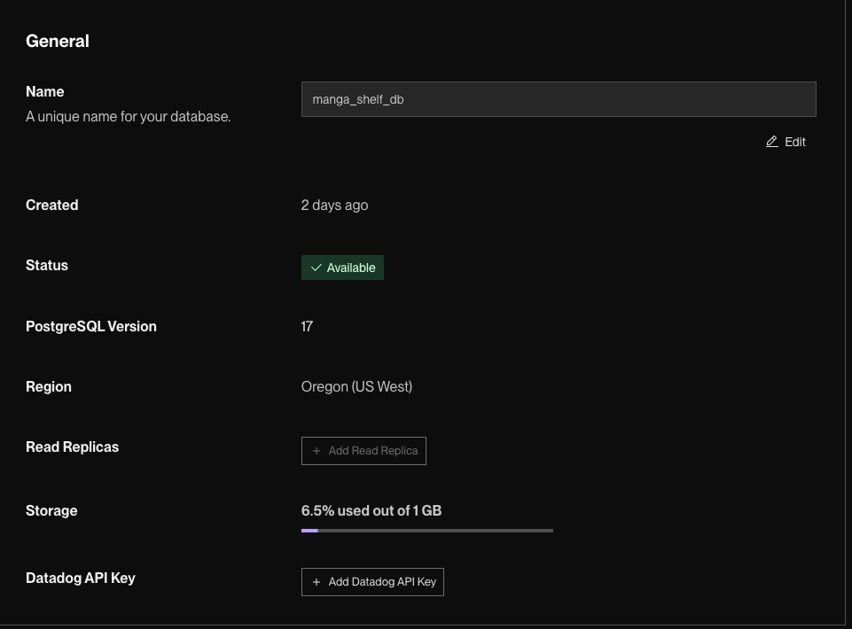

# WEB103 Project 1 - *MangaShelf*
Submitted by: **Ricardo Ortega-Pacheco**

Overview 

## Required Features

The following **required** functionality is completed:

<!-- Make sure to check off completed functionality below -->
- [x] **The web app uses only HTML, CSS, and JavaScript without a frontend framework**
- [x] **The web app displays a title**
- [x] **The web app displays at least five unique list items, each with at least three displayed attributes (such as title, text, and image)**
- [x] **The user can click on each item in the list to see a detailed view of it, including all database fields**
  - [x] **Each detail view should be a unique endpoint, such as as `localhost:3000/bosses/crystalguardian` and `localhost:3000/mantislords`**
  - [x] *Note: When showing this feature in the video walkthrough, please show the unique URL for each detailed view. We will not be able to give points if we cannot see the implementation* 
- [ ] **The web app serves an appropriate 404 page when no matching route is defined**
- [x] **The web app is styled using Picocss**

# WEB103 Project 2 - *MangaShelf 2 + PostgreSQL DB*

Submitted by: **Ricardo Ortega-Pacheco**

About this web app: **MangaShelf is a simple web application that let users browse a curated list of manga titles I recommend, view detailed information about each manga, and explore their attributes with Picocss. Data is implemented to a Postgres Database managed by Render.**

Time spent: **6** hours

## Required Features

The following **required** functionality is completed:

<!-- Make sure to check off completed functionality below -->
- [x] **The web app uses only HTML, CSS, and JavaScript without a frontend framework**
- [x] **The web app is connected to a PostgreSQL database, with an appropriately structured database table for the list items**
  - [x] **NOTE: Your walkthrough added to the README must include a view of your Render dashboard demonstrating that your Postgres database is available**
  - [x]  **NOTE: Your walkthrough added to the README must include a demonstration of your table contents. Use the psql command 'SELECT * FROM tablename;' to display your table contents.**

The following **optional** features are implemented:

- [ ] The user can search for items by a specific attribute

The following **additional** features are implemented:

- [x] Used their isbn as the unique ID for the db that will help with duplicates not being added to the db. 

## Video Walkthrough

Here's a walkthrough of implemented required features:

GIF created with ...  GIF tool here

### Render

### PostgreSQL 

Sorry did not display the full table. 

## Notes

 - Image was not rending from the database, learned that in the db, it the name was all lowercase: `coverimage`. Had to update the variables to `coverimage` from the client and server folder. 
